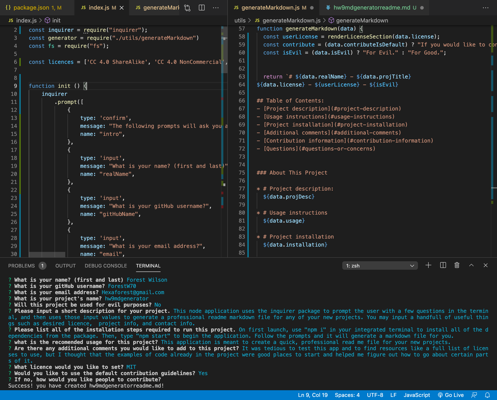

# Forest Wilson - Homework 9 - Readme generator
MIT - (https://opensource.org/licenses/MIT) - For Good.
<!-- Original deployment date: April 27th, 2021 -->

## Table of Contents:
- [This week's concepts](#this-weeks-concepts)
- [Tech used](#tech-used)
- [Project description](#project-description)
- [Usage instructions](#usage-instructions)
- [Project installation](#project-installation)
- [Additional comments](#additional-comments)
- [Contribution information](#contribution-information)
- [Questions](#questions-or-concerns)
- [Pictures, Links](#extras)

### About This Project

* # This weeks concepts:
  1. Node.js
  2. Npm packages
  3. Package/package.lock
  4. Exports/require
  
* # Tech used:
  1. JavaScript
  2. Node.js
  3. Npm
  4. Inquirer

* # Project description:
  Given a need for new readme files every week, I built a readme generator that runs in Node.js, where you are prompted to fill out some fields in the terminal, and once you are finished, a new markdown file is generated for you.

* # Usage instructions
  This application is meant to create a quick, professional read me file for your new projects.

* # Project installation
  1. npm i
  2. npm start
  3. fill out user prompts
  4. Enjoy.
     
* # Additional comments
(Apr/27/21)

  - It was tedious to test this app and to find resources like a full list of licenses to use, but I thought that the examples of code already in the project were good places to start and helped me figure out how to go about certain parts of it. I wasnt sure what we were supposed to put in the "tests" segment. I also would have liked to figure out how to create different paths of questions based on the response from another question, but I didn't have time to figure this out.

#### Contribution information 

- If you would like to contribute to this project, please follow best practices and message me at one of the provided contacts bellow if you want to push!

###### Questions or concerns? 
* Please contact me at one of the following!

  Email - Hexaforest@gmail.com
  gitHub - https://github.com/ForestW70/

# Extras
* Screenshots:
  

* Demo:
  [App demo](https://youtu.be/SuuVYTpCeO4)

* Links:
  [Repo page](https://github.com/ForestW70/Week-9-Node-Readme-Generator)
